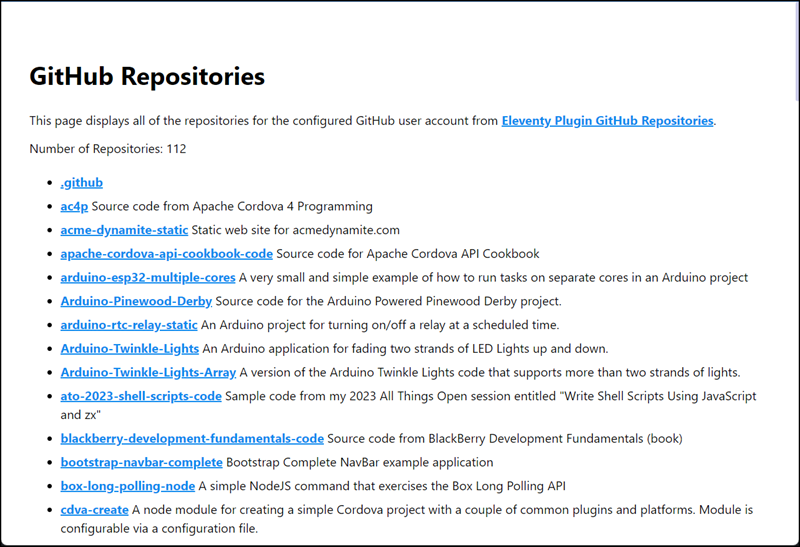

# Eleventy Plugin GitHub Repositories

An Eleventy plugin that creates a collection containing metadata from an account's GitHub repositories.

# Usage

Install the plugin by opening a terminal window or command prompt, navigating to an Eleventy project folder, and executing the following command:

```shell
npm install eleventy-plugin-github-repos
```

Next, in your Eleventy project's eleventy.config.js file, import the plugin as shown below:

```js
const githubRepos = require('eleventy-plugin-github-repos');
```

Then, inside the module.exports section, load the plugin:

```js
eleventyConfig.addPlugin(githubRepos, { userAccount: 'johnwargo' });
```

The `userAccount` configuration property specifies the GitHub account the plugin will build the list from. 

With this configuration, the plugin calls the GitHub `repos` API in unauthenticated mode (see [Adding a GitHub Repository List to an Eleventy Site](https://johnwargo.com/posts/2023/github-repository-list-eleventy/) for details) and GitHub will rate limit API requests to 60 per hour.

To get around this limitation, configure the plugin with a GitHub Access Token (for instructions on how to create one, see [Adding a GitHub Repository List to an Eleventy Site (part 2)](https://johnwargo.com/posts/2023/github-repository-list-eleventy-2/#:~:text=Generating%20a%20GitHub%20API%20Token)).

Write the GitHub Access Token to an environment variable, then modify the Eleventy site to configure the plugin to use the token using the following code:

```js
const apiKey = process.env.GITHUB_API_KEY;
  
eleventyConfig.addPlugin(githubRepos, { userAccount: 'johnwargo', apiKey});
```

Enable `debugMode` to write additional stuff to the console during the Eleventy build process:

```js
const apiKey = process.env.GITHUB_API_KEY;
const debugMode = true;
  
eleventyConfig.addPlugin(githubRepos, { userAccount: 'johnwargo', apiKey, debugMode});
```

Configure the plugin to exit the build process when it encounters an error using `quitOnError`

```js
const apiKey = process.env.GITHUB_API_KEY;
const debugMode = true;
const quitOnError = false;
  
eleventyConfig.addPlugin(githubRepos, { userAccount: 'johnwargo', apiKey, quitOnError});
```

# Rendering Repository Metadata

The GitHub `repos` API returns a lot of details about each repository; refer to https://docs.github.com/en/rest/repos/repos for an example.

To display data from the repository list use the `collections.githubRepos` collection as shown in the following example:

```liquid

  <p>Number of Repositories: {{ collections.githubRepos.length }}</p>
  <ul>
  
    <li>   
      <a href="{{ repo.html_url }}" target="_blank">{{ repo.name }}</a>
      
        {{ repo.description }}
      
    </li>
  
  </ul>  

  <p>No repository data to display</p>

```

# Demonstration

This repository contains a demo Eleventy site that demonstrations the plugin's capabilities. To run the demo, clone this repository to your local development system, then execute the following steps:

1. In the clones repository, modify the `eleventy.config.js` file to use your GitHub account name and (optionally) Access Token.
2. Open terminal window and navigate to the project folder
3. execute `npm install`
4. execute `npm start`

At this point, Eleventy will build the project and display a link you can click to view the sample page (http://localhost:8080 as shown in the text below):

```shell
D:\dev\11ty\eleventy-plugin-github-repos>npm start

> eleventy-plugin-github-repos@0.0.0 start
> tsc && eleventy --serve

[Eleventy-Plugin-GitHub-Repos] Fetching GitHub repositories for johnwargo
[Eleventy-Plugin-GitHub-Repos] Fetching https://api.github.com/users/johnwargo/repos?per_page=100&page=1
[Eleventy-Plugin-GitHub-Repos] Fetching https://api.github.com/users/johnwargo/repos?per_page=100&page=2
[Eleventy-Plugin-GitHub-Repos] Fetching https://api.github.com/users/johnwargo/repos?per_page=100&page=3
[Eleventy-Plugin-GitHub-Repos] Duration: 1.225s
[Eleventy-Plugin-GitHub-Repos] Retrieved repository metadata for 112 repos
[11ty] Writing _site/index.html from ./src/index.liquid
[11ty] Copied 3 files / Wrote 1 file in 1.28 seconds (v2.0.1)
[11ty] Watching…
[11ty] Server at http://localhost:8080/
```



*** 

If this code helps you, please consider buying me a coffee.

<a href="https://www.buymeacoffee.com/johnwargo" target="_blank"></a>